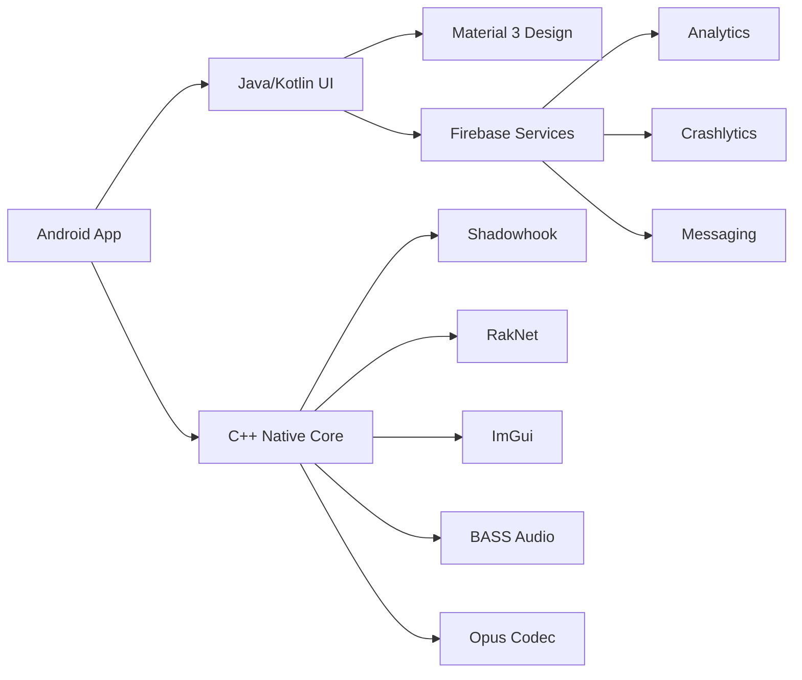

<p align="center">
  
</p>

<h1 align="center">🚀 DjavaLauncher — Download Center</h1>

### *Advanced SA:MP Mobile Client — Release Distribution Hub*

<br>

[](https://github.com/Nathan-Studios/DjavaLauncher/releases/latest)
[](https://github.com/Nathan-Studios/DjavaLauncher)
[](https://www.android.com/)
[](https://developer.android.com/ndk/guides/abis)
[](https://developer.android.com/about/versions/oreo)
[](LICENSE)
[](https://discord.gg/djavalauncher)

<br>


---

<br>

</div>

<table align="center">
<tr>
<td align="center" width="25%">
<br>
<b>🚀 Latest Build</b><br>
<sub>v2.10 Dynamic</sub>
</td>
<td align="center" width="25%">
<br>
<b>📱 Min SDK</b><br>
<sub>Android 8.0+</sub>
</td>
<td align="center" width="25%">
<br>
<b>🌐 ABI Support</b><br>
<sub>arm64-v8a + armeabi-v7a</sub>
</td>
<td align="center" width="25%">
<br>
<b>⚡ Native Core</b><br>
<sub>C++20 · Shadowhook</sub>
</td>
</tr>
</table>

<br>

---

## 📋 Table of Contents

- [📥 Download](#-download)
- [✨ Features](#-features)
- [⚙️ Technical Stack](#%EF%B8%8F-technical-stack)
- [📰 Announcements](#-announcements)
- [📜 Changelog](#-changelog)
- [📸 Screenshots](#-screenshots)
- [🚀 Getting Started](#-getting-started)
- [🤝 Credits](#-credits)

---

## 📥 Download

<div align="center">

### Latest Release

[](https://github.com/Nathan-Studios/DjavaLauncher/releases/latest)
[](https://github.com/Nathan-Studios/DjavaLauncher/releases)
[](https://discord.gg/djavalauncher)

</div>

> **Note:** This is the official download center for **DjavaLauncher-2.0**. The client source remains closed-source, distributed through this distribution hub.

---

## ✨ Features

<details open>
<summary><b>🎨 Modern Launcher (Material 3 UI)</b></summary>
<br>

| Feature | Description | Status |
|:--------|:------------|:------:|
| **Material 3 Design** | Clean, modern interface following Android 14+ design standards | ✅ Stable |
| **Responsive Bottom Nav** | Adaptive navigation with Material 3 icons | ✅ Stable |
| **Dynamic Credits Dialog** | Interactive credits with animated content | ✅ Stable |
| **Donate Dialog** | In-app support dialog with multiple payment options | ✅ Stable |
| **Auto-Downloader** | Download & verify game assets automatically | ✅ Stable |
| **Server Management** | Add, manage, connect to SA:MP servers | ✅ Stable |
| **Flexible Settings** | Deep customization for launcher & game client | ✅ Stable |
| **Forced Update System** | Inline APK download & install with version validation | ✅ Stable |
| **Custom Storage Path** | `/Android/DjavaLauncher/files/` with toggle | ✅ Stable |

</details>

<details>
<summary><b>🎮 High-Performance Game Client</b></summary>
<br>

| Feature | Description | Status |
|:--------|:------------|:------:|
| **OpenGL Reflections** | Real-time vehicle reflections | ✅ Stable |
| **Water Shader** | Enhanced water rendering | ✅ Stable |
| **Custom SkyBox** | High-quality sky textures | ✅ Stable |
| **Real-Time Shadows** | Dynamic shadow system (ported from peak-reference) | ✅ Stable |
| **Time Cycle** | Advanced time-of-day lighting | ✅ Stable |
| **Weather System** | Enhanced weather effects | ✅ Stable |
| **Render Buffer** | Optimized rendering pipeline | ✅ Stable |
| **Performance Tweaks** | Disabled `CCorona` for max FPS | ✅ Stable |

</details>

<details>
<summary><b>🛠️ Enhanced Gameplay</b></summary>
<br>

| Feature | Description | Status |
|:--------|:------------|:------:|
| **Voice Chat** | Built-in Opus codec voice communication | ✅ Stable |
| **ImGui UI** | Professional in-game menus, chat, scoreboard | ✅ Stable |
| **Java Chat Window** | RecyclerView chat window (peak-reference style) | ✅ Stable |
| **Java Dialog System** | Peak-reference style dialog UI | ✅ Stable |
| **Multi-Touch Support** | Mobile-optimized controls | ✅ Stable |
| **Custom Keyboard** | Optimized input for chat & commands | ✅ Stable |
| **Kick Button** | Native kick action support | ✅ Stable |
| **Crosshair Overlay** | In-game crosshair rendering | ✅ Stable |
| **Attached Object Fix** | Correct rotation & flickering fixes | ✅ Stable |

</details>

<details>
<summary><b>🔧 Advanced Technical Features</b></summary>
<br>

| Feature | Description | Status |
|:--------|:------------|:------:|
| **XOR Obfuscated Versioning** | Unified version system with obfuscation | ✅ Stable |
| **Crashlytics NDK** | Native crash reporting via Firebase | ✅ Stable |
| **Texture DB System** | Texture database with fallback handling | ✅ Stable |
| **Procedural Plate Textures** | Auto-generated license plates | ✅ Stable |
| **RLE Decompression** | Mali GPU crash fix, 64-bit pointer safe | ✅ Stable |
| **RakNet Networking** | Low-latency synchronization | ✅ Stable |
| **BASS Audio** | High-fidelity sound with SSL support | ✅ Stable |
| **Custom Storage** | External storage with permission handling | ✅ Stable |

</details>

---

## ⚙️ Technical Stack

<div align="center">



</div>

| Layer | Technology | Purpose |
|:------|:-----------|:--------|
| **UI Layer** | Kotlin + Java + Material 3 | Splash, Main, Game activities |
| **Native Layer** | C++20 · CMake 3.12+ | Game hooks, rendering, networking |
| **Hooking** | Shadowhook 1.0.9 (ByteDance) | Function interception |
| **Networking** | RakNet (SA:MP 0.3.7) | Game synchronization |
| **Audio** | BASS · BASS_SSL · Opus | Sound & voice chat |
| **Security** | Paranoid + XOR Obfuscation | Code protection |
| **Analytics** | Firebase BOM 33.6.0 | Crash reporting, analytics |
| **Rendering** | OpenGL ES 3.0 | Graphics & shaders |

---

## 📰 Announcements

<div align="center">

| Date | Title | Description |
|:----:|:------|:------------|
| 🆕 **19 May 2026** | **Welcome to Djava Launcher!** | Experience SA:MP Mobile with modern features, high performance, and Material 3 design. |
| 🔄 **18 May 2026** | **Client Update v1.0.5** | UI system overhaul and audio bug fixes. Update to the latest version! |
| 🎉 **17 May 2026** | **Community Weekly Event** | Djava Roleplay server weekend events. Check Discord for details! |

</div>

---

## 📜 Changelog

### 🏗️ Dev Branch — Recent Milestones

<details open>
<summary><b>🔖 v1.4 (Build 134)</b> — Latest</summary>

| Date | Commit | Description |
|:----:|:------|:------------|
| 2026-06-04 | `109f5d8` | 🎨 Material 3 icons, responsive bottom nav, dynamic credits, donate dialog |
| 2026-06-03 | `24b2e84` | 🐛 Fix crash: texture DB recursion + menu DB registration |
| 2026-06-03 | `728762e` | 🔄 Restore texture formats, CRenderTarget, SAMP.IMG/SAMPCOL.IMG |
| 2026-06-03 | `34951a8` | 👕 Fix clothes texture crash with fallback system |
| 2026-06-03 | `15ad224` | 🚗 Fix plate texture crash — unregister DB after lookup |
| 2026-06-03 | `fbfccde` | 🔤 Fix font crash — guard with access() check |
| 2026-06-03 | `a64aa79` | 🏷️ Procedural fallback plate textures |
| 2026-06-03 | `d71a6f8` | 💾 Custom storage path implementation |
| 2026-06-03 | `ea97f2c` | 📦 Port texture & plate system from peak-reference |

</details>

<details>
<summary><b>🔖 v1.3 (Build 133)</b></summary>

| Date | Commit | Description |
|:----:|:------|:------------|
| 2026-06-02 | `cab03c5` | 🐛 Fix loading loop — remove early native lib loading |
| 2026-06-02 | `5be2ff0` | 🔐 Unified versioning with XOR obfuscation |
| 2026-06-02 | `3e67f1c` | 📲 Update system robustness — APK validation |
| 2026-06-02 | `3d57aff` | 🎮 Fix GTA buttons unresponsive (peak-reference style) |

</details>

<details>
<summary><b>🔖 v1.2 (Build 132)</b></summary>

| Date | Commit | Description |
|:----:|:------|:------------|
| 2026-06-02 | `79bfa55` | ⬇️ Forced update system with inline APK download |
| 2026-06-01 | `03f2caf` | 🖱️ Fix touch events — consumed-flag approach |
| 2026-06-01 | `9782f6d` | 🔄 Fix attached objects rotation (degrees vs radians) |
| 2026-06-01 | `432293e` | 💬 Fix chat/tab restore after unpause |
| 2026-06-01 | `aed92cd` | ✅ Fix dialog select behavior |
| 2026-06-01 | `79b0ba0` | 🌓 Port Shadow, TimeCycle, WaterLevel, Weather |
| 2026-06-01 | `1bc1225` | 🖼️ Fix HUD texture bugs via off-screen displacement |
| 2026-06-01 | `638764c` | 🔑 Update keystore, Firebase, API endpoints |

</details>

<details>
<summary><b>🔖 v1.1 (Build 131)</b></summary>

| Date | Commit | Description |
|:----:|:------|:------------|
| 2026-05-31 | `df24476` | 🎬 Fix attached object flickering |
| 2026-05-31 | `13f1d29` | ⌨️ Fix chat keyboard & dialog input |
| 2026-05-31 | `46c91a9` | 💬 Replace dialog system (peak-reference) |
| 2026-05-31 | `ca5e31a` | 📱 Migrate chat to Java with keyboard fix |
| 2026-05-30 | `81cd4d0` | 🔄 Replace ImGui chat with RecyclerView |
| 2026-05-29 | `850cbce` | 💧 Watermark v1.04 + dynamic chat sizing |

</details>

<details>
<summary><b>🔖 v1.0 — Initial Release</b></summary>

| Date | Commit | Description |
|:----:|:------|:------------|
| 2026-05-29 | `2acb5fa` | 🔧 RLE decompression + LoadFullTexture hook |
| 2026-05-29 | `96c6438` | 💾 Custom storage path implementation |
| 2026-05-29 | `286546a` | 🛡️ Android 14+ compatibility fixes |
| 2026-05-25 | `98dff73` | 🔧 Mali GPU crash fix (64-bit pointer safety) |
| 2026-05-24 | `9066900` | 📦 Unified datagame.zip download |
| 2026-05-23 | `db22409` | 🔗 Open.mp dialog compatibility |
| 2026-05-21 | `d7fa5c2` | 🌓 Re-enable real-time shadows |
| 2026-05-20 | `3da024a` | 🎨 Material 3 UI Migration |

</details>

</details>

<details>
<summary><b>📜 Full Git History Reference</b></summary>

<br>

<details>
<summary>🎨 UI/UX</summary>

- Material 3 UI Migration (`3da024a`)
- Dynamic credits & donate dialog (`109f5d8`)
- Responsive bottom nav with M3 icons (`109f5d8`)
- Splash & update screen redesign
- Java RecyclerView chat window (`81cd4d0`)
- Peak-reference style dialog system (`46c91a9`)
</details>

<details>
<summary>🐛 Crash Fixes</summary>

- Texture DB recursion crash (`24b2e84`)
- Clothes texture crash (`34951a8`)
- Plate texture crash (`15ad224`)
- Font crash — access() guard (`fbfccde`)
- Login crash resolution (`8b306ad`)
- RLE decompression Mali GPU fix (`98dff73`)
- Open.mp dialog compatibility (`db22409`)
- Touch events consumed-flag fix (`03f2caf`)
</details>

<details>
<summary>🔧 Native Improvements</summary>

- Shadowhook migration (`a3fe7f8`)
- GlossHook integration (`a6dac2a`)
- Custom storage path (`d71a6f8`)
- XOR obfuscated versioning (`5be2ff0`)
- Texture format & plate system (`ea97f2c`)
- BASS audio + SSL support (`17d59f3`)
</details>

<details>
<summary>🎮 Graphics</summary>

- Port Shadow/TimeCycle/WaterLevel (`79b0ba0`)
- Real-time shadows re-enabled (`d7fa5c2`)
- OpenGL Reflections
- Custom SkyBox
- HUD texture off-screen fix (`1bc1225`)
</details>

<details>
<summary>📲 Distribution</summary>

- Forced update system (`79bfa55`)
- Unified datagame.zip (`9066900`)
- APK version validation (`3e67f1c`)
- Auto-copy to Laragon (`3ae989a`)
</details>

<details>
<summary>🏗️ Infrastructure</summary>

- Firebase BOM 33.6.0 (`45d98be`)
- Crashlytics NDK (`1b3c5fc`)
- ABI splits (`b79167b`)
- NDK 26.2 / C++20 (`ccaf385`)
</details>

</details>

---

## 📸 Screenshots

<div align="center">

| Dashboard | In-Game UI | Settings |
|:---------:|:----------:|:--------:|
|  |  |  |

</div>

---

## 🚀 Getting Started

### Prerequisites

- 📱 Android device running **Android 8.0 (Oreo)** or higher
- 🎮 Legitimate copy of **Grand Theft Auto: San Andreas** (v2.00+)
- 📶 Stable internet connection for initial asset download

### Quick Installation

```bash
# 1. Download the latest APK from our release page
# 2. Enable "Install from Unknown Sources" on your device
# 3. Install the APK
# 4. Open DjavaLauncher
# 5. Follow the on-screen prompts to download game assets
# 6. Set your nickname in Settings
# 7. Browse the server list and start playing!
```

### Build from Source (Contributors)

> **Note:** The DjavaLauncher-2.0 client is closed-source. This repository only distributes pre-built releases.  
> For development inquiries, join our [Discord](https://discord.gg/djavalauncher).

---

## 🤝 Credits

<div align="center">

### 🏆 DjavaLauncher Development Team

</div>

| Role | Contributor | Contributions |
|:----:|:------------|:--------------|
| **👑 Lead Maintainer** | [NathanKanaeru](https://github.com/NathanKanaeru) | Overall development, modern UI/UX, maintenance |
| **⚙️ Core Developer** | [x1y2z](https://github.com/x1y2z) | Original client architecture |
| **🎨 Graphics Engineer** | [kuzia15](https://github.com/kuzia15) | OpenGL Reflections, WaterShader, core improvements |
| **☁️ Rendering Specialist** | [psychobye](https://github.com/psychobye) | Custom SkyBox implementation |
| **🛠️ Systems Developer** | [blazervng](https://github.com/blazervng) | HUD, RPC systems, graphics optimization, bug fixes |

### 🙏 Special Thanks

- **peak-reference** — Reference implementation for UI, rendering, and gameplay features
- **SA:MP Mobile Community** — Continuous support and feedback
- **Open.mp Team** — Multiplayer protocol compatibility
- **ByteDance** — Shadowhook library
- **Un4seen Developments** — BASS Audio Library

---

<div align="center">

<br>

<i>Made with ❤️ for the SA:MP Mobile Community</i><br>
<b>DjavaLauncher © 2025-2026 Nathan Studios</b>

<br><br>

[](https://github.com/Nathan-Studios/DjavaLauncher)
[](https://github.com/Nathan-Studios/DjavaLauncher)

<br>

</div>
